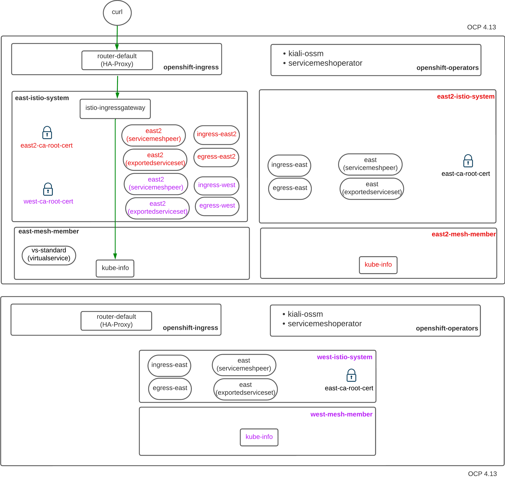

:scrollbar:
:data-uri:
:toc2:
:linkattrs:

= OSSM Federation - Intro

:numbered:

== Set-up

=== Initial Architecture

image::docs/images/simple-fed-setup.png[]

The diagram above depicts two OCP clusters with one or more OSSM control planes.
Each ServiceMeshControlPlane is configured with `additional ingress` and `additional egress` gateways.
Each addition ingress/egress has a corresponding unique service account.
Those SAs serve as the `clientId` when defining `ServiceMeshPeers`.

From the perspective of external meshes, all that is known is the clientId of the additional ingress/egress gateways.

=== Pre-Reqs

This lab is designed to work in a set-up involving two OpenShift 4.13 (or more recent) clusters.  Via the `oc` utility, you should have _cluster-admin_ access to each of these clusters.

Your clusters can reside anywhere (ie: on-prem and/or in the cloud).
However, one consideration is that your OpenShift clusters should all be enabled with an implementation of the_LoadBalancer_ type of Kubernetes service.
ie:  _metallb_ if clusters are on-prem.

=== OSSM Operators

. Execute the following on all OpenShift clusters (ie:  _east_ and _west_ )
+
-----
$ oc apply -k infra
-----

Doing so install Red Hat OpenShift Service Mesh (OSSM).

=== OSSM Control Planes

==== east

. Service Mesh Control Plane:
+
-----
$ oc apply -k east/infra \
  && oc apply -k east/mesh-cp

$ oc wait --for condition=Ready -n east-istio-system smcp/east-fed --timeout 300s
-----

. Application:
+
-----
$ oc apply -k east/app

$ curl -X GET http://$(oc get route istio-ingressgateway -n east-istio-system --template='{{.spec.host}}')/info
-----

==== east2

. Service Mesh Control Plane:
+
-----
$ oc apply -k east2/infra \
  && oc apply -k east2/mesh-cp

$ oc wait --for condition=Ready -n east2-istio-system smcp/east2-fed --timeout 300s
-----

. Application:
+
-----
$ oc apply -k east2/app

$ curl -X GET http://$(oc get route istio-ingressgateway -n east2-istio-system --template='{{.spec.host}}')/info
-----

==== west

. Service Mesh Control Plane:
+
-----
$ oc apply -k west/infra \
  && oc apply -k west/mesh-cp

$ oc wait --for condition=Ready -n west-istio-system smcp/west-fed --timeout 300s
-----

. Application:
+
-----
$ oc apply -k west/app

$ curl -X GET http://$(oc get route istio-ingressgateway -n west-istio-system --template='{{.spec.host}}')/info
-----

== Federation:

=== OC Config Utility Setup

.. Rename OCP config names for each cluster (similar to the following):
+
-----
$ oc config rename-context east-istio-system/api-den-east-ratwater-xyz:6443/system:admin east-istio
$ oc config rename-context west-istio-system/api-den-west-ratwater-xyz:6443/system:admin west-istio
-----

=== east - east2

. Share istio root certificates between mesh tenants:
+
-----
$ oc config use-context east-istio \
    && oc get cm istio-ca-root-cert -n east2-istio-system -o yaml \
    | sed 's/namespace: .*/namespace: east-istio-system/' \
    | sed 's/name: .*/name: east2-ca-root-cert/' | oc apply -n east-istio-system -f -

$ oc config use-context east-istio \
    && oc get cm istio-ca-root-cert -n east-istio-system -o yaml \
    | sed 's/namespace: .*/namespace: east2-istio-system/' \
    | sed 's/name: .*/name: east-ca-root-cert/' | oc apply -n east2-istio-system -f -
-----

. east2:  Apply `ServiceMeshPeer` & `ExportedServiceSet`
+
-----
$ oc config use-context east-istio \
    && oc apply -k east2/mesh-fed
-----

. east:  Apply `ServiceMeshPeer` & `ImportedServiceSet`
+
-----
$ oc config use-context east-istio \
    && oc apply -k east/mesh-fed/east2
-----

. east2:  Check Statuses:

.. ServiceMeshPeer status:
+
-----
$ oc config use-context east-istio \
    && oc -n east2-istio-system get servicemeshpeer east -o json | jq .status
-----

.. ExportedServiceSet status:
+
-----
$ oc config use-context east-istio \
    && oc get exportedserviceset east -n east2-istio-system -o json | jq .status
-----

. east:  Check Statuses:
.. ServiceMeshPeer status:
+
-----
$ oc config use-context east-istio \
    && oc -n east-istio-system get servicemeshpeer east2 -o json | jq .status
-----
+
The status value for inbound (remotes[0].connected) and outbound (watch.connected) connections must be true. 
It may take a moment as the full synchronization happens every 5 minutes. 
If you don’t see a successful connection status for a while, check the logs of the istiod pod. 
You can ignore the warning in the istiod logs for “remote trust domain not matching the current trust domain…”.

.. ImportedServiceSet status:
+
-----
$ oc config use-context east-istio \
    && oc -n east-istio-system get importedservicesets east2 -o json | jq .status
-----

=== east - west

. Swapping CA Root certificates

.. East cert to west:
+
-----
$ oc config use-context east-istio \
    && EAST_MESH_CERT=$(oc get configmap -n east-istio-system istio-ca-root-cert -o jsonpath='{.data.root-cert\.pem}')
$ echo "$EAST_MESH_CERT" | openssl x509 -subject -noout

$ oc config use-context west-istio \
    && oc create configmap east-ca-root-cert --from-literal=root-cert.pem="$EAST_MESH_CERT" -n west-istio-system
-----

.. West cert to east:
+
-----
$ oc config use-context west-istio \
    && WEST_MESH_CERT=$(oc get configmap -n west-istio-system istio-ca-root-cert -o jsonpath='{.data.root-cert\.pem}')
$ echo "$WEST_MESH_CERT" | openssl x509 -subject -noout

$ oc config use-context east-istio \
    && oc create configmap west-ca-root-cert --from-literal=root-cert.pem="$WEST_MESH_CERT" -n east-istio-system
-----

. *west*:  Apply `ServiceMeshPeer` & `ExportedServiceSet`
+
-----
$ oc config use-context west-istio \
    && oc apply -k west/mesh-fed
-----

. *east*:  Apply `ServiceMeshPeer` & `ImportedServiceSet`
+
-----
$ oc config use-context east-istio \
    && oc apply -k east/mesh-fed/west
-----

. *west*: check statuses:

.. ServiceMeshPeer status:
+
-----
$ oc config use-context west-istio \
    && oc -n west-istio-system get servicemeshpeer east -o json | jq .status
-----

.. ExportedServiceSet status:
+
-----
$ oc get exportedserviceset east -n west-istio-system -o json | jq .status
-----

. *east*: check statuses:
.. ServiceMeshPeer status:
+
-----
$ oc config use-context east-istio \
    && oc -n east-istio-system get servicemeshpeer west -o json | jq .status
-----
+
The status value for inbound (remotes[0].connected) and outbound (watch.connected) connections must be true. 
It may take a moment as the full synchronization happens every 5 minutes. 
If you don’t see a successful connection status for a while, check the logs of the istiod pod. 
You can ignore the warning in the istiod logs for “remote trust domain not matching the current trust domain…”.

.. ImportedServiceSet status:
+
-----
$ oc -n east-istio-system get importedservicesets west -o json | jq .status
-----
+
NOTE:  It might take istio a minute or two to reconcile the updated importedserviceset.  Until then, the importedserviceset will simply not report a status.

== Traffic Mgmt Patterns

=== Mirror

image::docs/images/simple-fed-mirror.png[]

NOTE:  check comments in east/mesh-fed/west/kustomization.yml  and east/mesh-fed/east2/kustomization.yml

-----
$ oc delete virtualservice --all -n east-mesh-member

$ oc apply -f east/app/vs-mirror.yml

$ oc logs -f `oc get pod -n west-mesh-member | grep "kube-info" | awk '{print $1}'` -n west-mesh-member

$ for i in {1..10}
  do
    curl -X GET http://$(oc get route istio-ingressgateway -n east-istio-system --template='{{.spec.host}}')/info;
    sleep 1;
  done
-----

=== Server Side Loadbalancing

image::docs/images/simple-fed-server-side-lb.png[]

NOTE:  check comments in east/mesh-fed/west/kustomization.yml  and east/mesh-fed/east2/kustomization.yml

-----
$ oc delete virtualservice --all -n east-mesh-member

$ oc apply -f east/app/vs-server-side-lb.yml

$ for i in {1..10}
  do
    curl -X GET http://$(oc get route istio-ingressgateway -n east-istio-system --template='{{.spec.host}}')/info;
    sleep 1;
  done
-----

=== Federated Mesh Fail-over

==== Overview

image::docs/images/simple-fed-failover.png[]

Istio detects faulty instances, or outliers. In the Istio lexicon this is known as outlier detection. The strategy is to first detect an outlier container and then make it unavailable for a pre-configured duration, or what's called a sleep window. While the container is in the sleep window, it is excluded from any routing or load balancing. An analogy would be front porch lights on Halloween night: If the light is off, the house isn't participating, for whatever reason. You can skip it and save time, visiting only the active houses. If the homeowner arrives home 30 minutes later and turns on the porch light, go get some candy.

==== Setup

. east-mesh-member: Scale down business app:
+
-----
$ oc scale deploy/kube-info -n east-mesh-member --replicas=0
-----

. east2-mesh-member: Scale down business app:
+
-----
$ oc scale deploy/kube-info -n east2-mesh-member --replicas=0
-----

. Configure VirtualService and `outlierDetection` enabled DestinationRule:
+
-----
$ oc apply -f east/app/vs-kube-info-standard.yml
$ oc apply -f east2/app/vs-kube-info-standard.yml
$ oc apply -f east/app/dr-fed-failover.yml
-----

. Test:
+
-----
$ for i in {1..100}
  do
    curl -X GET http://$(oc get route istio-ingressgateway -n east-istio-system --template='{{.spec.host}}')/info;
    sleep 2;
  done
-----

. Scale up business app in east2/east-mesh-member:
+
-----
$ oc scale deploy/kube-info -n east2-mesh-member --replicas=1
$ oc scale deploy/kube-info -n east-mesh-member --replicas=1
-----

== Deletion

=== All

. east and east2
+
-----
$ oc config use-context east-istio \
    && oc delete -k east2/mesh-fed/ --ignore-not-found=true \
    && oc delete -k east/mesh-fed/east2 --ignore-not-found=true \
    && oc delete -k east/mesh-fed/west --ignore-not-found=true \
    && oc delete virtualservices -n east-mesh-member --all \
    && oc delete virtualservices -n east2-mesh-member --all \
    && oc delete cm east2-ca-root-cert -n east-istio-system --ignore-not-found=true \
    && oc delete cm west-ca-root-cert -n east-istio-system --ignore-not-found=true \
    && oc delete -k east/app --ignore-not-found=true \
    && oc delete -k east2/app --ignore-not-found=true \
    && oc delete -k east/mesh-cp --ignore-not-found=true \
    && oc delete -k east2/mesh-cp --ignore-not-found=true \
    && oc delete -k east/infra --ignore-not-found=true \
    && oc delete -k east2/infra --ignore-not-found=true
-----

. west
+
-----
$ oc config use-context west-istio \
    && oc delete -k west/mesh-fed --ignore-not-found=true \
    && oc delete cm east-ca-root-cert -n west2-istio-system --ignore-not-found=true \
    && oc delete -k west/app --ignore-not-found=true \
    && oc delete -k west/mesh-cp --ignore-not-found=true \
    && oc delete -k west/infra --ignore-not-found=true
-----

. Optional:  purge OSSM operators
+
-----
$ oc delete -k infra --ignore-not-found=true \
  && oc delete validatingwebhookconfiguration openshift-operators.servicemesh-resources.maistra.io \
  && oc -n openshift-operators delete sa istio-cni istio-operator kiali-operator ossm-cni \
  && oc -n openshift-operators delete cm istio-ca-root-cert istio-cni-config maistra-operator-cabundle ossm-cni-config-v2-4 \
  && oc delete ClusterRoleBinding istio-cni istio-cni-repair-rolebinding \
  && oc delete daemonset istio-cni-node istio-cni-node-v2-4 \
  && oc delete NetworkAttachmentDefinition.k8s.cni.cncf.io istio-cni -n default
-----
+
-----
$ for i in  $(oc get ClusterRole | grep 'maistra\|istio' | awk '{print $1;}') 
  do
    oc delete ClusterRole $i
  done
-----
+
-----
$ for i in  $(oc get ClusterRoleBinding | grep 'maistra\|istio' | awk '{print $1;}') 
  do
    oc delete ClusterRoleBinding $i
  done
-----

. Optional:  Ensure all Istio related CSVs are deleted:
+
-----
$ oc get csv -n openshift-operators
-----

=== Reset to base OSSM setup

. east and east2
+
-----
$ oc config use-context east-istio \
    && oc delete -k east2/mesh-fed/ --ignore-not-found=true \
    && oc delete -k east/mesh-fed/east2 --ignore-not-found=true \
    && oc delete -k east/mesh-fed/west --ignore-not-found=true \
    && oc delete virtualservices -n east-mesh-member --all \
    && oc delete virtualservices -n east2-mesh-member --all \
    && oc delete cm east-ca-root-cert -n east2-istio-system --ignore-not-found=true \
    && oc delete cm east2-ca-root-cert -n east-istio-system --ignore-not-found=true \
    && oc delete cm west-ca-root-cert -n east-istio-system --ignore-not-found=true \
    && oc delete destinationrules -n east-mesh-member --all
-----

. west
+
-----
$ oc config use-context west-istio \
    && oc delete -k west/mesh-fed --ignore-not-found=true \
    && oc delete cm east-ca-root-cert -n west-istio-system --ignore-not-found=true
-----

== Reference

. link:https://www.opensourcerers.org/2022/01/24/getting-started-with-openshift-servicemesh-federation/[Getting started with OpenShift ServiceMesh Federation; Jan 2022]
. link:https://cloud.redhat.com/blog/a-guide-to-creating-a-true-hybrid/multi-cloud-architecture-with-ossm-federation[Multi Cloud Architecture w/ OSSM Federation]
. link:https://istio.io/latest/blog/2021/external-locality-failover/[Configuring Failover for External Services; Jun 2021]
. link:https://docs.google.com/presentation/d/1RBIS9ggRIM7aWNGLGmCfB9N-b7MjrGKn9nGma9RwM0E/edit#slide=id.gcfb7c4abeb_0_44[Corresponding presentation]

== Appendix

=== Troubleshooting

. The following does not return anything:
+
-----
$ oc -n east-istio-system exec istio-ingressgateway-5f9dbfd7c6-qx7g4  -- curl localhost:15000/stats | grep outlier
-----

