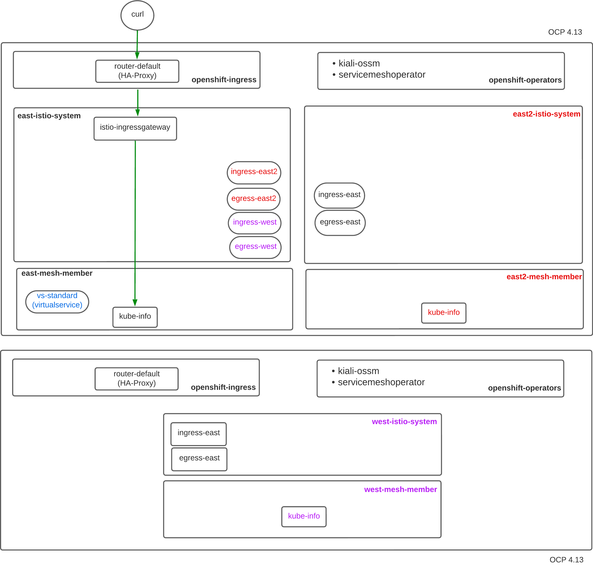
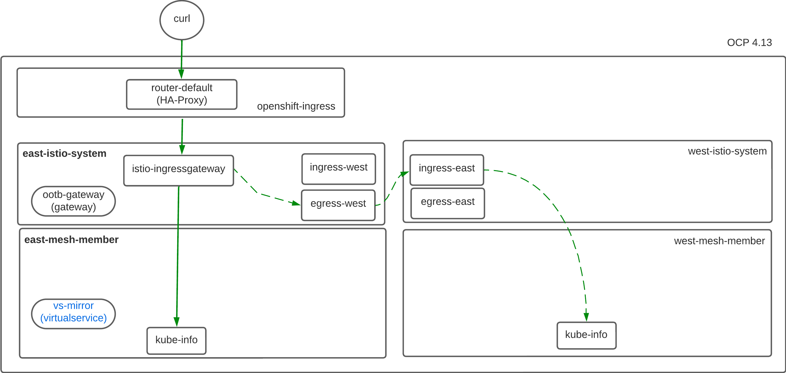
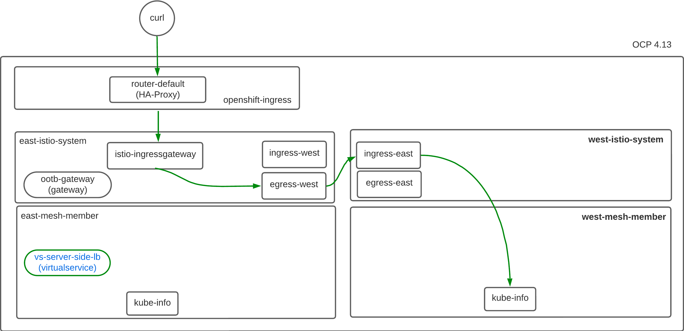
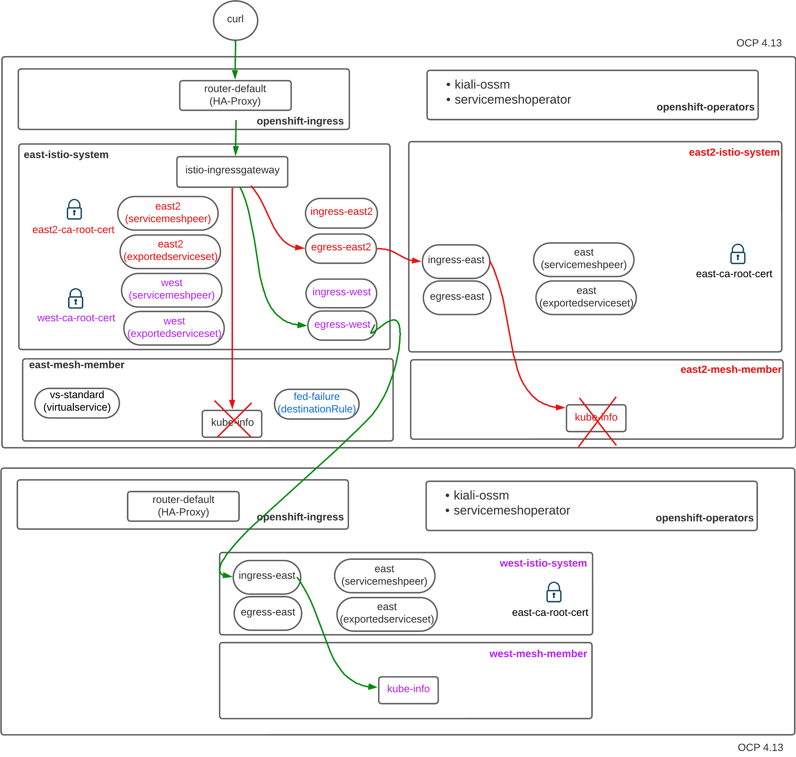

:scrollbar:
:data-uri:
:toc2:
:linkattrs:

= OSSM Federation - Intro

:numbered:

== Set-up

=== Common

-----
$ oc apply -k infra
-----

=== East - East2

==== East

. Service Mesh Control Plane:
+
-----
$ oc apply -k east/infra \
  && oc apply -k east/mesh-cp

$ oc wait --for condition=Ready -n east-istio-system smcp/east-fed --timeout 300s
-----

. Application:
+
-----
$ oc apply -k east/app

$ curl -X GET http://$(oc get route istio-ingressgateway -n east-istio-system --template='{{.spec.host}}')/info
-----

==== East2

. Service Mesh Control Plane:
+
-----
$ oc apply -k east2/infra \
  && oc apply -k east2/mesh-cp

$ oc wait --for condition=Ready -n east2-istio-system smcp/east2-fed --timeout 300s
-----

. Application:
+
-----
$ oc apply -k east2/app

$ curl -X GET http://$(oc get route istio-ingressgateway -n east2-istio-system --template='{{.spec.host}}')/info
-----

=== West

. Service Mesh Control Plane:
+
-----
$ oc apply -k west/infra \
  && oc apply -k west/mesh-cp

$ oc wait --for condition=Ready -n west-istio-system smcp/west-fed --timeout 300s
-----

. Application:
+
-----
$ oc apply -k west/app

$ curl -X GET http://$(oc get route istio-ingressgateway -n west-istio-system --template='{{.spec.host}}')/info
-----

== Federation:

=== east - east2

. Share istio root certificates between mesh tenants:
+
-----
$ oc get cm istio-ca-root-cert -n east2-istio-system -o yaml \
    | sed 's/namespace: .*/namespace: east-istio-system/' \
    | sed 's/name: .*/name: east2-ca-root-cert/' | oc apply -n east-istio-system -f -

$ oc get cm istio-ca-root-cert -n east-istio-system -o yaml \
    | sed 's/namespace: .*/namespace: east2-istio-system/' \
    | sed 's/name: .*/name: east-ca-root-cert/' | oc apply -n east2-istio-system -f -
-----
+
NOTE: Alternative approach described in Appendix section.

. east:  Apply `ServiceMeshPeer` & `ImportedServiceSet`
+
-----
$ oc apply -k east/mesh-fed/east2
-----

. east2:  Apply `ServiceMeshPeer` & `ExportedServiceSet`
+
-----
$ oc apply -k east2/mesh-fed
-----

. ServiceMeshPeer status:
+
-----
$ oc -n east-istio-system get servicemeshpeer east2 -o json | jq .status
$ oc -n east2-istio-system get servicemeshpeer east -o json | jq .status
-----
+
The status value for inbound (remotes[0].connected) and outbound (watch.connected) connections must be true. 
It may take a moment as the full synchronization happens every 5 minutes. 
If you don’t see a successful connection status for a while, check the logs of the istiod pod. 
You can ignore the warning in the istiod logs for “remote trust domain not matching the current trust domain…”.

. ExportedServiceSet status:
+
-----
$ oc get exportedserviceset east -n east2-istio-system -o json | jq .status
-----

. ImportedServiceSet status:
+
-----
$ oc -n east-istio-system get importedservicesets east2 -o json | jq .status
-----

=== east - west

== Traffic Mgmt Patterns

=== Mirror

-----
$ oc delete virtualservice --all -n east-mesh-member

$ oc apply -f east/app/vs-mirror.yml

$ oc logs -f `oc get pod -n west-mesh-member | grep "kube-info" | awk '{print $1}'` -n west-mesh-member

$ for i in {1..10}
  do
    curl -X GET http://$(oc get route istio-ingressgateway -n east-istio-system --template='{{.spec.host}}')/info;
    sleep 1;
  done
-----

=== Server Side Loadbalancing

-----
$ oc delete virtualservice --all -n east-mesh-member

$ oc apply -f east/app/vs-server-side-lb.yml

$ for i in {1..10}
  do
    curl -X GET http://$(oc get route istio-ingressgateway -n east-istio-system --template='{{.spec.host}}')/info;
    sleep 1;
  done
-----

=== Federated Mesh Fail-over

. Clean existing mesh federation configs:
+
-----
$ oc delete -k west/mesh-fed/ --ignore-not-found=true \
    && oc delete -k east/mesh-fed/ --ignore-not-found=true \
    && oc delete virtualservices -n east-mesh-member --all \
    && oc delete virtualservices -n west-mesh-member --all
-----

. Configure mesh federation configs:
+
-----
$ oc apply -k west/mesh-fed
$ oc apply -f east/mesh-fed/servicemeshpeers.yml
$ oc apply -f east/mesh-fed/importedserviceset-failover.yml
-----

. Check status of Exported/Import ServiceSets:
+
-----
$ oc get exportedserviceset east -n west-istio-system -o json | jq .status
$ oc -n east-istio-system get importedservicesets west -o json | jq .status
-----

. Scale down business app in east-mesh-member:
+
-----
$ oc scale deploy/kube-info -n east-mesh-member --replicas=0
-----

. Configure VirtualService and `outlierDetection` enabled DestinationRule:
+
-----
$ oc apply -f east/app/vs-kube-info-standard.yml
$ oc apply -f east/app/dr-fed-failover.yml
-----

. Test:
+
-----
$ for i in {1..20}
  do
    curl -X GET http://$(oc get route istio-ingressgateway -n east-istio-system --template='{{.spec.host}}')/info;
    sleep 10;
  done
-----

. Scale up business app in east-mesh-member:
+
-----
$ oc scale deploy/kube-info -n east-mesh-member --replicas=1
-----

== Deletion

. east and east2
+
-----
$ oc delete -k east2/mesh-fed/ --ignore-not-found=true \
    && oc delete -k east/mesh-fed/east2 --ignore-not-found=true \
    && oc delete virtualservices -n east-mesh-member --all \
    && oc delete virtualservices -n east2-mesh-member --all \
    && oc delete cm east2-ca-root-cert -n east-istio-system --ignore-not-found=true \
    && oc delete cm east-ca-root-cert -n west2-istio-system --ignore-not-found=true \
    && oc delete -k east/app --ignore-not-found=true \
    && oc delete -k east2/app --ignore-not-found=true \
    && oc delete -k east/mesh-cp --ignore-not-found=true \
    && oc delete -k east2/mesh-cp --ignore-not-found=true \
    && oc delete -k east/infra --ignore-not-found=true \
    && oc delete -k east2/infra --ignore-not-found=true
-----

. west
+
-----
-----

== Reference

. link:https://www.opensourcerers.org/2022/01/24/getting-started-with-openshift-servicemesh-federation/[Getting started with OpenShift ServiceMesh Federation; Jan 2022]
. link:https://cloud.redhat.com/blog/a-guide-to-creating-a-true-hybrid/multi-cloud-architecture-with-ossm-federation[Multi Cloud Architecture w/ OSSM Federation]
. link:https://istio.io/latest/blog/2021/external-locality-failover/[Configuring Failover for External Services; Jun 2021]
. link:https://docs.google.com/presentation/d/1RBIS9ggRIM7aWNGLGmCfB9N-b7MjrGKn9nGma9RwM0E/edit#slide=id.gcfb7c4abeb_0_44[Corresponding presentation]

== Appendix

=== Swapping CA Root certificates

-----
$ oc config use-context aro
$ ARO_STG_MESH_CERT=$(oc get configmap -n aro-stg-mesh istio-ca-root-cert -o jsonpath='{.data.root-cert\.pem}')
$ echo "$ARO_STG_MESH_CERT" | openssl x509 -subject -noout

$ oc config use-context rosa
$ oc create configmap aro-stg-mesh-ca-root-cert --from-literal=root-cert.pem="$ARO_STG_MESH_CERT" -n rosa-prod-mesh
-----
